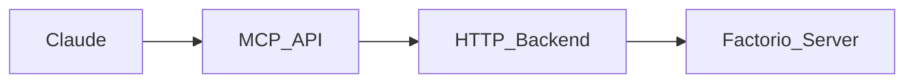

# Factorio MCP Server 🏭

A [Model Context Protocol](https://www.anthropic.com/news/model-context-protocol) (MCP) server for managing Factorio servers using Claude. This repository contains two main components:

1. An HTTP backend that securely wraps RCON commands (backend/server.py)
2. An MCP server that provides a high-level interface for Claude (factorio_mcp.py)

## Architecture



## Backend Server

The backend server provides a secure HTTP interface to Factorio's RCON, requiring API key authentication. This isolates the RCON password and provides a clean HTTP interface for the MCP server.

### Setup

1. Install requirements:
```bash
pip install fastapi uvicorn python-dotenv mcrcon
```

2. Create a .env file:
```env
RCON_HOST=localhost  # Your Factorio server hostname
RCON_PORT=27015     # Your Factorio RCON port
RCON_PASSWORD=xxx   # Your Factorio RCON password
API_KEY=xxx         # Generate a secure API key (only supports one api key, for your MCP server to use)
```

3. Run the server:
```bash
uvicorn backend.server:app --host 0.0.0.0 --port 8000
```

### API Endpoints

- `GET /` - Health check
- `POST /execute_command` - Execute RCON command
  - Requires `X-API-Key` header
  - Body: `{"command": "your command"}`

## MCP Server

The MCP server provides a high-level interface for Claude to interact with Factorio, built using FastMCP.

### Features

- Execute arbitrary Lua commands with explanations
- Player management (teleport, give items)
- Server monitoring
- Screenshot capabilities

### Setup

1. Install fastmcp:
```bash
pip install fastmcp
```

2. Install the MCP server:
```bash
fastmcp install factorio_mcp.py -e API_KEY=your_backend_api_key
```

### Available Tools

- `execute_command(command: str)` - Execute raw RCON commands
- `run_lua(code: str, explanation: str)` - Run Lua code with announcements
- `get_player_count()` - Check online players
- `send_message(message: str)` - Broadcast to all players
- `give_items(player: str, item: str, count: int)` - Give items to players
- `teleport_player(player: str, x: float, y: float)` - Teleport players
- `get_player_info(player: str)` - Get player details
- `take_screenshot(player?: str, resolution?: Dict)` - Take screenshots
